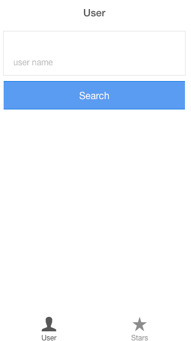

# git-stars

This is a phone application created using the Ionic Framework that can be used to see which repositories you've starred on Github.

## Running the app locally
 -  "npm install"
 -  "bower install"
 -  "ionic serve"